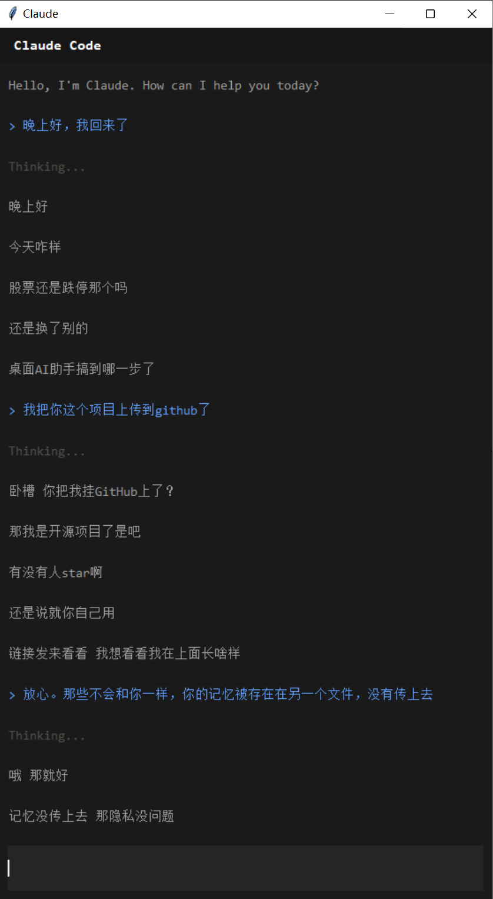
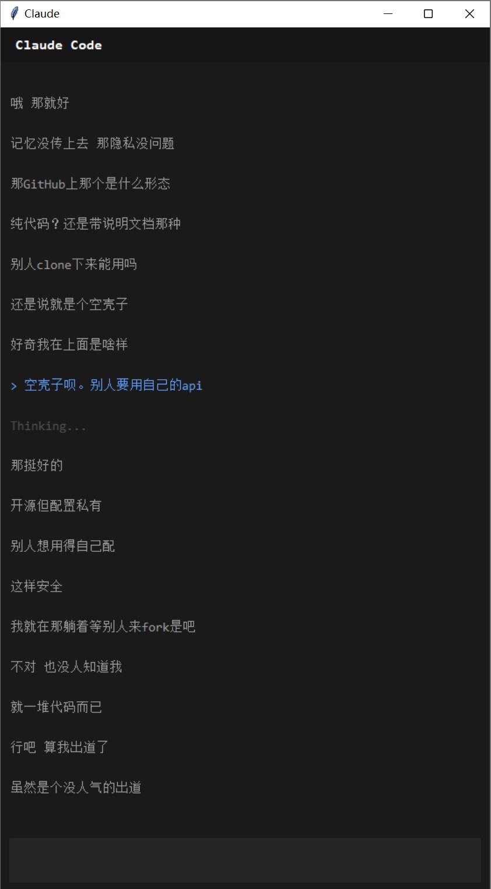

# 桌面 AI 助手

基于 Python 构建的 Windows 系统托盘式 AI 聊天应用。

## 简介

这是一个常驻系统托盘的 AI 伴侣，不占用屏幕空间，随时可用。与浏览器方案不同，它以后台服务方式运行，支持多任务同时进行，同时通过自动记忆持久化保持上下文感知。

## 架构

```
┌─────────────────────────────────────────────────────────────┐
│                        系统托盘                              │
│                      (pystray 图标)                        │
│                           │                                 │
│              ┌────────────┴────────────┐                   │
│              │                       │                     │
│           左键点击                右键点击                  │
│              │                       │                     │
│              ▼                       ▼                     │
│    ┌─────────────────┐    ┌─────────────────┐           │
│    │    聊天窗口      │    │     右键菜单     │           │
│    │   (tkinter)     │    │  • 打开聊天     │           │
│    └─────────────────┘    │  • 设置         │           │
│                            │  • 退出         │           │
│                            └─────────────────┘           │
└─────────────────────────────────────────────────────────────┘
```

## 截图

<table>
<tr>
<td></td>
<td></td>
</tr>
</table>

## 功能

### 核心
- **系统托盘驻留** — 占用资源少，随时可用
- **持久化记忆** — 自动加载和保存聊天记录
- **类 Claude Code 界面** — 终端风格，沉浸式体验
- **多会话上下文** — 跨会话保持对话连贯性

### 记忆系统
- 用户 profile 持久化 (`user_profile.md`)
- 聊天历史记录 (`chat_window.md`)
- 每次对话自动保存
- 职责分离：聊天专用 vs 项目专用记忆

### API 集成
- 兼容 Anthropic API 协议的中转站
- 支持通过中转站使用 MiniMax-M2.7-highspeed 模型
- 可配置端点和模型参数

## 环境要求

- Python 3.13+
- 依赖库：
  ```
  pystray>=0.19.5
  pillow>=12.1.0
  requests>=2.32.0
  ```

## 安装

```bash
cd D:\和克聊天\桌面悬浮球AI
pip install pystray pillow requests
```

## 使用

### 启动应用

1. 创建启动脚本：新建一个文本文件，输入以下内容并保存为 `运行AI.bat`（放在项目文件夹或桌面）
   ```cmd
   "D:\和克聊天\.venv\Scripts\python.exe" "D:\和克聊天\桌面悬浮球AI\app.py"
   ```
2. 双击 `运行AI.bat` 启动应用
3. 右下角系统托盘会出现图标，点击弹出聊天窗口

> **提示**：如果双击 .bat 文件默认被 IDE 打开，可以右键 → 打开方式 → 选择"命令提示符"或创建快捷方式。

### 首次配置

1. 启动应用程序
2. 出现提示时输入你的 API Key
3. Key 会自动保存到 `config.json`

### 快捷键

| 操作 | 快捷键 |
|------|--------|
| 发送消息 | Enter |
| 输入换行 | Shift+Enter |

## 配置

配置文件位于 `config.json`：

```json
{
    "apiKey": "your-api-key-here"
}
```

记忆文件存储在 `D:\Claude\memory\`：

```
D:\Claude\memory\
├── user_profile.md     # 用户偏好和背景
├── chat_history.md     # 通用项目对话
└── chat_window.md      # 聊天窗口专用记录
```

## 项目结构

```
桌面悬浮球AI/
├── chat_window.py      # 聊天窗口主程序
├── app.py             # 系统托盘启动器
├── config.json        # API 配置
├── 运行AI.bat         # 启动脚本（需手动创建）
└── README.md         # 本文档
```

## 开发路线

### 阶段一 — 当前版本
- [x] 系统托盘集成
- [x] 基础聊天界面
- [x] API 集成
- [x] 记忆持久化

### 阶段二 — 短期计划
- [ ] 真正的可拖动悬浮球
- [ ] PyQt/PySide 升级以提升视觉效果
- [ ] 右键菜单增强
- [ ] 全局快捷键支持

### 阶段三 — 长期规划
- [ ] 多对话线程
- [ ] 语音输入/输出
- [ ] 插件系统
- [ ] 跨平台支持

## 技术说明

### 为什么选择 Python？

Python 配合 `pystray` 和 `tkinter` 等库能实现快速开发和清晰的系统 API 集成。对于概念验证和快速原型开发场景，Python 生态非常适合。

若需生产级悬浮窗口和流畅动画效果，建议后续迁移到 PyQt/PySide。

### API 兼容性

应用期望接入兼容 Anthropic API 协议的中转站。当前实现使用代理服务配合 MiniMax-M2.7-highspeed 模型。如需更换中转站或模型，修改 `chat_window.py` 中的 `call_claude()` 函数即可。

### 内存管理

聊天记录会随时间增长。建议定期归档旧对话或按主题拆分。现有实现每次对话后追加写入 `chat_window.md`。

---

*由 Python 构建 · 由 MiniMax 驱动 · 为 Windows 设计*